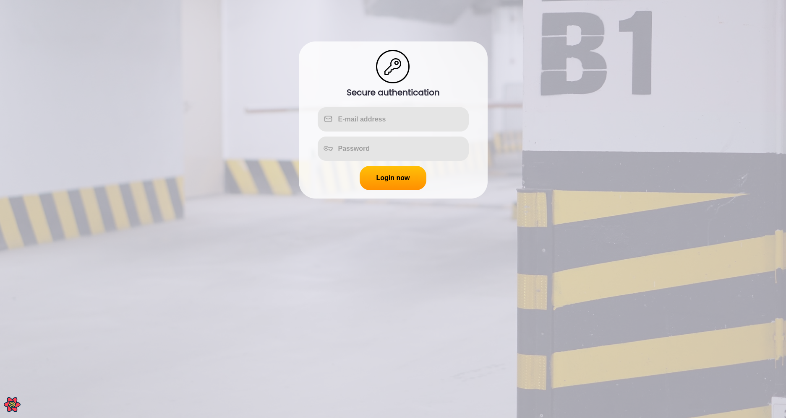
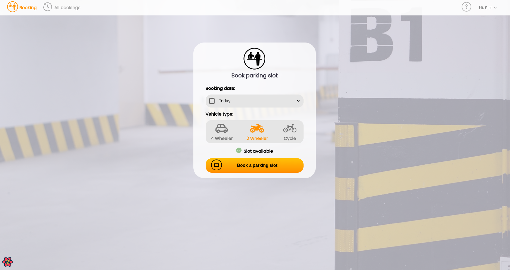
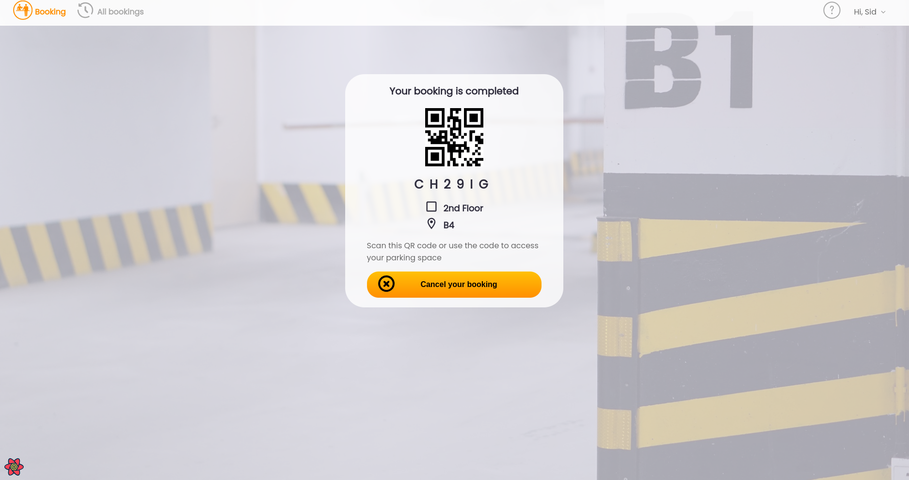

# Parking Ticket 🚗 🛵 🚲

A simple parking ticket booking application  created using React and Spring Boot.

## Get Started

The main repository is a Spring Boot project using Maven. First, install all dependencies:
```bash
mvn install
```

Ensure to configure the `application.properties` file for MySQL database connection before running the Spring Boot application. To start the backend, run:

```bash
mvn spring-boot:run
```
To start the React frontend, navigate to the frontend directory and install the required dependencies:
```bash
cd frontend/
npm install 
```
Start the frontend server:
```bash
npm run dev
```

## Project screenshots






